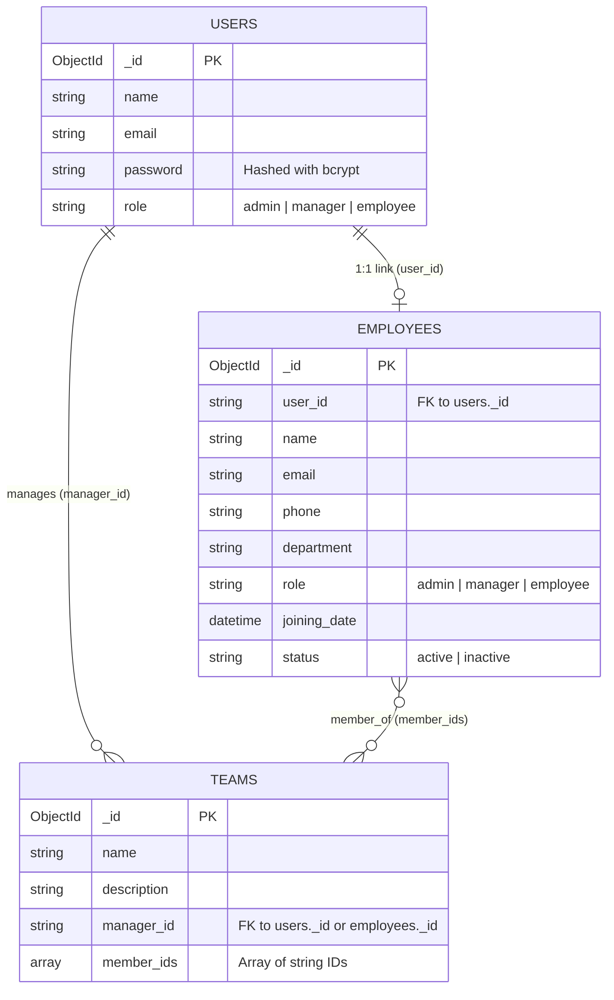

# TaskFlow - Project Audit

**Document Version:** 1.0.0  
**Audit Date:** September 2026  
**Repository:** TaskFlow  
**Audit Scope:** Full Codebase, Configuration, Infrastructure, Documentation, Security, and Architecture  

---

## 1. Project Overview

TaskFlow is designed as a collaborative, multi-tenant/organization team task management system. The intended application enables businesses to organize their workforce across departments and teams, manage projects and task lifecycles, assign responsibilities, track progress, maintain audit trails through comments, and manage employee lifecycles with role-based access control (Admin, Manager, Employee).

The repository currently contains a nascent FastAPI backend application with initial support for authentication, employee management, and team management, accompanied by Docker Compose definitions for local database services and early project documentation. The mobile/web frontend directory exists but contains no code.

---

## 2. Current Technology Stack

| Layer / Component | Technology | Version / Specification | Source / Location |
|---|---|---|---|
| **Runtime** | Python | 3.13 (`py -3.13`) | `docs/SETUP.md`, `taskflow-backend/venv` |
| **Backend Framework** | FastAPI | `0.141.1` | `taskflow-backend/requirements.txt` |
| **ASGI Server** | Uvicorn | `0.52.1` | `taskflow-backend/requirements.txt` |
| **Data Validation / Settings** | Pydantic / Pydantic Settings | `2.13.4` / `2.14.2` | `taskflow-backend/requirements.txt` |
| **Primary Database** | MongoDB | Engine 8.0 (image `mongo:8`) | `compose.yaml` |
| **MongoDB Async Driver** | Motor / PyMongo | `3.7.1` / `4.17.0` | `taskflow-backend/requirements.txt` |
| **Cache / In-Memory Store** | Redis | Engine 8.0 (image `redis:8`) | `compose.yaml` |
| **Redis Async Client** | redis-py (asyncio) | `8.1.0` | `taskflow-backend/requirements.txt` |
| **Authentication & Crypto** | Python-Jose / Passlib / Bcrypt | `3.5.0` / `1.7.4` / `4.3.0` | `taskflow-backend/requirements.txt` |
| **Containerization** | Docker Compose | Specification 3.x / Compose v2 | `compose.yaml` |
| **Frontend Framework** | Flutter / Dart | Planned (Not yet initialized) | `docs/ARCHITECTURE.md`, `taskflow-app/` |
| **Automated Testing** | None configured | No tests or test runners found | Codebase inspection |

---

## 3. Project Structure

The repository root is organized into backend, frontend, documentation, and container configuration:

```text
TaskFlow/
├── .gitignore                          # Root Git ignore file
├── compose.yaml                        # Docker Compose configuration for MongoDB & Redis
├── docs/                               # Project documentation
│   ├── API.md                          # API endpoint documentation (outdated draft)
│   ├── ARCHITECTURE.md                 # System architecture overview
│   ├── CHANGELOG.md                    # Release version changelog
│   ├── COMMANDS.md                     # CLI helper commands reference
│   ├── DATABASE.md                     # Database collections overview
│   ├── DECISIONS.md                    # Architectural Decision Records (ADRs)
│   ├── ERRORS.md                       # Known error resolutions and troubleshooting
│   ├── LEARNING_JOURNAL.md             # Development environment notes
│   ├── PROJECT_ROADMAP.md              # High-level sprint roadmap
│   ├── README.md                       # Project summary and introduction
│   └── SETUP.md                        # Local development setup instructions
├── taskflow-app/                       # Mobile/Web frontend directory (currently empty)
└── taskflow-backend/                   # FastAPI backend service
    ├── .dockerignore                   # Docker ignore file (0 bytes / empty)
    ├── .env                            # Local environment configuration file
    ├── Dockerfile                      # Backend container Dockerfile (0 bytes / empty)
    ├── requirements.txt                # Python package dependencies
    ├── venv/                           # Python virtual environment (ignored by Git)
    └── app/                            # Backend source code root
        ├── config/
        │   └── settings.py             # Pydantic BaseSettings environment loader
        ├── core/
        │   ├── dependencies.py         # HTTPBearer token extraction & validation
        │   ├── jwt.py                  # JWT encoding/decoding utilities
        │   ├── roles.py                # Role authorization dependency factory
        │   └── security.py             # Passlib password hashing & verification
        ├── database/
        │   ├── dependencies.py         # FastAPI database and collection dependencies
        │   ├── mongodb.py              # Motor AsyncIOMotorClient singleton manager
        │   ├── redis.py                # Redis asyncio client singleton manager
        │   └── redis_dependencies.py   # Redis client dependency provider
        ├── middleware/                 # Middleware directory (currently empty)
        ├── models/                     # Data models directory (currently empty)
        ├── repositories/               # Repository pattern directory (currently empty)
        ├── routes/
        │   ├── __init__.py             # Route package init
        │   ├── auth.py                 # User registration and authentication routes
        │   ├── employees.py            # Employee management CRUD routes
        │   ├── health.py               # Health check and diagnostic routes
        │   └── teams.py                # Team management routes
        ├── schemas/
        │   ├── employee_schema.py      # Pydantic models for employee operations
        │   ├── team_schema.py          # Pydantic models for team operations
        │   └── user_schema.py          # Pydantic models for user auth
        ├── services/
        │   ├── employee_service.py     # Employee business logic and MongoDB operations
        │   └── team_service.py         # Team business logic and MongoDB operations
        ├── utils/                      # Helper utilities directory (currently empty)
        └── main.py                     # FastAPI application entry point
```

---

## 4. Configuration and Dependencies

### 4.1 Dependency Inspection (`taskflow-backend/requirements.txt`)

The Python backend pins the following exact package versions:

- `fastapi==0.141.1` & `uvicorn==0.52.1` & `starlette==1.3.1`: Modern async web application framework.
- `pydantic==2.13.4`, `pydantic-settings==2.14.2`, `pydantic_core==2.46.4`: Data validation and environment parsing.
- `motor==3.7.1` & `pymongo==4.17.0`: Async driver for MongoDB operations.
- `redis==8.1.0`: Async client library for Redis.
- `passlib==1.7.4` & `bcrypt==4.3.0`: Password hashing. *Note: bcrypt is explicitly pinned to 4.3.0 to avoid the passlib 72-byte string/attribute bug in bcrypt 5.x.*
- `python-jose==3.5.0`, `ecdsa==0.19.2`, `rsa==4.9.1`, `pyasn1==0.6.4`: Cryptographic tokens and JWT encoding/decoding.
- `email-validator==2.3.0` & `dnspython==2.8.0` & `idna==3.18`: RFC-compliant email string validation in Pydantic models.
- `python-dotenv==1.2.2`: `.env` file parsing support.

### 4.2 Environment Configuration (`taskflow-backend/.env`)

The backend loads configuration via `app/config/settings.py` from `.env`:

```ini
APP_NAME=TaskFlow
APP_ENV=development

MONGODB_URL=mongodb://localhost:27017
# MONGODB_URL=mongodb://mongodb:27017
MONGODB_DATABASE=taskflow

REDIS_URL=redis://localhost:6379
# REDIS_URL=redis://redis:6379

JWT_SECRET=supersecretkey
JWT_ALGORITHM=HS256
ACCESS_TOKEN_EXPIRE_MINUTES=30
```

### 4.3 Settings Evaluation (`app/config/settings.py`)

- Uses `pydantic_settings.BaseSettings` with `SettingsConfigDict(env_file=".env", extra="ignore")`.
- All fields (`app_name`, `app_env`, `mongodb_url`, `mongodb_database`, `redis_url`, `jwt_secret`, `jwt_algorithm`, `access_token_expire_minutes`) are defined without fallback default values. If any key is missing from `.env` or system environment variables, application startup will fail immediately with a `ValidationError`.

---

## 5. Current Development Environment

### 5.1 Local Services (`compose.yaml`)

The repository provides a Docker Compose file defining infrastructure services for local development:

```yaml
services:
  mongodb:
    image: mongo:8
    container_name: taskflow-mongodb
    ports:
      - "27017:27017"
    volumes:
      - mongodb_data:/data/db

  redis:
    image: redis:8
    container_name: taskflow-redis
    ports:
      - "6379:6379"
    volumes:
      - redis_data:/data

volumes:
  mongodb_data:
  redis_data:
```

### 5.2 Current vs. Production Setup

- **Current Development Setup:**
  - MongoDB and Redis run in Docker containers exposing ports `27017` and `6379` to `localhost`.
  - The FastAPI backend runs on the host machine via local Python virtual environment (`uvicorn app.main:app --reload`).
  - No backend container is included in `compose.yaml`.
  - `taskflow-backend/Dockerfile` and `taskflow-backend/.dockerignore` are present as empty files (0 bytes).
- **Intended Production Setup:**
  - Full multi-container orchestration with backend containerization, health checks, environment separation, non-root user execution, persistent named volumes, and private Docker network bridging (internal DNS resolution `mongodb:27017` and `redis:6379`).

---

## 6. Backend Architecture

### 6.1 Application Entry Point (`app/main.py`)

- Instantiates `FastAPI(title=settings.app_name, version="1.0.0")`.
- Registers routers: `health_router`, `auth_router`, `employee_router`, and `team_router`.
- Lifecycle management: Uses deprecated `@app.on_event("startup")` and `@app.on_event("shutdown")` hooks to connect and disconnect MongoDB and Redis singletons. *(Modern FastAPI recommends `lifespan` context manager).*
- **CORS Middleware:** Not configured. Cross-Origin requests from web/Flutter clients will be blocked by default.

### 6.2 Database Layer (`app/database/`)

- **MongoDB (`app/database/mongodb.py`):**
  - Manages singleton `Database` instance holding `AsyncIOMotorClient` and `AsyncIOMotorDatabase`.
  - Connects on startup using `settings.mongodb_url` and validates connection via `admin.command("ping")`.
  - Does not configure connection pooling options (min/max pool size, connection timeouts).
  - Does not execute index creation or schema validation at startup.
- **Redis (`app/database/redis.py`):**
  - Manages singleton `RedisManager` instance using `redis.asyncio.from_url`.
  - Configures `decode_responses=True` and `protocol=2` (for Redis 7/8 protocol compatibility).
  - Validates connection via `client.ping()`.
- **FastAPI Dependencies (`app/database/dependencies.py` & `redis_dependencies.py`):**
  - `get_database()`: Returns `db.database`.
  - `get_user_collection()`: Returns `db.database["users"]`.
  - `get_employee_collection()`: Returns `db.database["employees"]`.
  - `get_team_collection()`: Returns `db.database["teams"]`.
  - `get_redis()`: Returns `redis_manager.client`.

### 6.3 Security & Authentication Layer (`app/core/`)

- **Password Hashing (`app/core/security.py`):** Passlib `CryptContext(schemes=["bcrypt"], deprecated="auto")`.
- **JWT Handling (`app/core/jwt.py`):** Generates HS256 JWT tokens containing custom claims and UTC `exp` timestamp. Decodes and verifies signature, returning decoded payload or `None` on failure.
- **Authentication Dependency (`app/core/dependencies.py`):** `get_current_user` extracts Bearer token via `HTTPBearer()`, decodes token, and returns payload dictionary (`{"user_id": str, "role": str}`).
- **Role-Based Access Control (`app/core/roles.py`):** `require_roles(*allowed_roles)` returns a dependency checking `current_user.get("role") in allowed_roles`, raising `403 Forbidden` if unauthorized.

### 6.4 Service Layer (`app/services/`)

- **Employee Service (`app/services/employee_service.py`):**
  - Handles employee creation, listing, retrieval by ID, partial update, and soft-deactivation.
  - Converts Pydantic `date` object (`joining_date`) to `datetime.datetime` for MongoDB BSON compatibility during creation.
- **Team Service (`app/services/team_service.py`):**
  - Handles team creation, listing, and retrieval by ID.
  - Initializes new teams with an empty `member_ids` list.

---

## 7. Frontend Architecture

### 7.1 Status of Frontend (`taskflow-app/`)

- **Current State:** Directory exists at repository root but is completely empty.
- **Missing Elements:**
  - No `pubspec.yaml` or `pubspec.lock`.
  - No Dart source code, directory structures (`lib/`, `test/`, `assets/`), or platform folders (`android/`, `ios/`, `web/`, `windows/`, `linux/`, `macos/`).
  - No state management, routing, API client, or authentication flows implemented.

### 7.2 Intended Frontend Architecture (Planned)

According to `docs/ARCHITECTURE.md` and `docs/PROJECT_ROADMAP.md`, the frontend will be built with Flutter targeting multi-platform support. The planned architecture will require:
- Clean architecture or feature-first folder structure (`features/auth`, `features/employees`, `features/teams`, `features/projects`, `features/tasks`, `features/dashboard`).
- State management solution (e.g., Riverpod or Bloc).
- Secure storage for JWT tokens (`flutter_secure_storage` / SharedPreferences).
- HTTP client with interceptors for automatic Bearer token injection and 401 handling.
- Role-based navigation guards (Admin, Manager, Employee view differentiation).

---

## 8. Database Architecture

### 8.1 Primary Database: MongoDB

- **Database Name:** `taskflow`
- **Collections in Use:**
  1. `users`: Stores login credentials and authentication roles.
  2. `employees`: Stores detailed employee profiles and organizational data.
  3. `teams`: Stores team definitions and member references.
- **Planned Collections (Documented in `docs/DATABASE.md`):**
  - `projects` *(Not implemented)*
  - `tasks` *(Not implemented)*
  - `comments` *(Not implemented)*
  - `notifications` *(Not implemented)*

### 8.2 Document Schemas and Relationships



### 8.3 MongoDB Indexes

- **Current State:** No indexes are created or defined programmatically in code or via startup scripts.
- **Impact:**
  - `users.email` is queried with `find_one({"email": ...})` without a unique index. Duplicate emails can be inserted under concurrent requests.
  - Queries on `_id` rely on the default MongoDB primary index.
  - Queries filtering by `employees.user_id`, `employees.status`, `teams.manager_id`, or `teams.member_ids` will perform full collection scans as data grows.

### 8.4 Redis Usage Audit

- **Current State:** Redis client is configured in `app/database/redis.py`, connects and pings during startup in `app/main.py`, and exposes a dependency `get_redis` in `app/database/redis_dependencies.py`.
- **Actual Utilization:** **0%**. Redis is not imported or used in any service, route, middleware, or utility. No caching, session management, rate limiting, or pub/sub queuing is currently implemented.

---

## 9. Authentication and Authorization

### 9.1 Authentication Flow

1. **User Registration (`POST /auth/register`):**
   - Accepts `UserCreateSchema` (`name`, `email`, `password`, `role`).
   - Checks if email exists in `users` collection via `find_one`.
   - Hashes password using bcrypt.
   - Inserts document into `users` collection.
2. **User Login (`POST /auth/login`):**
   - Accepts `UserLoginSchema` (`email`, `password`).
   - Retrieves user document by email.
   - Verifies plaintext password against stored bcrypt hash.
   - Issues JWT token containing payload: `{"user_id": str(db_user["_id"]), "role": db_user["role"], "exp": ...}`.
   - Returns `{"access_token": token, "token_type": "bearer"}`.

### 9.2 Authorization Architecture

- **Token Extraction:** `HTTPBearer` extracts token from `Authorization: Bearer <token>` header.
- **Token Validation:** `decode_access_token` verifies cryptographic signature and expiration.
- **Role Enforcement:** `require_roles("admin")` or `require_roles("admin", "manager")` verifies `role` claim in decoded token.
- **Roles Present in Code:**
  - `admin`: Full access to employee and team management.
  - `manager`: Read access to employees, read and create access to teams.
  - `employee`: Standard role with access only to basic authenticated endpoints.

### 9.3 Security Flaws Identified in Auth Design

- **Privilege Escalation during Registration:** `POST /auth/register` accepts arbitrary `role` string from the client (default `"employee"`). An unauthenticated client can register directly with `role: "admin"`.
- **Disconnected User & Employee Accounts:**
  - `POST /employees/` creates both a user and an employee record, setting a hardcoded default password `"Temp@123"`.
  - `PATCH /employees/{id}/deactivate` sets employee status to `"inactive"` but does not disable the corresponding `users` account or invalidate existing JWT tokens.
  - `get_current_user` does not verify if the user account or employee is active or still exists in the database. Deactivated or deleted accounts can continue using valid JWTs until expiration.

---

## 10. API Overview

### 10.1 Verified Endpoints Table

| HTTP Method | Route Endpoint | Purpose | Authentication | Authorization | Implementation Status |
|---|---|---|---|---|---|
| `GET` | `/` | Root welcome message | None (Public) | None | ✅ IMPLEMENTED |
| `GET` | `/health` | Service health check | None (Public) | None | ✅ IMPLEMENTED |
| `GET` | `/protected` | Authenticated test endpoint | Required (Bearer) | Any authenticated user | ✅ IMPLEMENTED (Test/Debug) |
| `GET` | `/admin-test` | Admin authorization test endpoint | Required (Bearer) | Role: `admin` | ✅ IMPLEMENTED (Test/Debug) |
| `POST` | `/auth/register` | Register new user account | None (Public) | None | ✅ IMPLEMENTED |
| `POST` | `/auth/login` | Authenticate user & issue JWT | None (Public) | None | ✅ IMPLEMENTED |
| `POST` | `/employees/` | Create employee profile and user login | Required (Bearer) | Role: `admin` | ✅ IMPLEMENTED |
| `GET` | `/employees/` | List all employees | Required (Bearer) | Role: `admin`, `manager` | ✅ IMPLEMENTED |
| `GET` | `/employees/{employee_id}` | Retrieve employee by ID | Required (Bearer) | Role: `admin`, `manager` | ✅ IMPLEMENTED |
| `PUT` | `/employees/{employee_id}` | Update employee profile details | Required (Bearer) | Role: `admin` | ✅ IMPLEMENTED |
| `PATCH` | `/employees/{employee_id}/deactivate` | Soft-deactivate an employee | Required (Bearer) | Role: `admin` | ✅ IMPLEMENTED |
| `POST` | `/teams/` | Create a new team | Required (Bearer) | Role: `admin`, `manager` | ✅ IMPLEMENTED |
| `GET` | `/teams/` | List all teams | Required (Bearer) | Role: `admin`, `manager` | ✅ IMPLEMENTED |
| `GET` | `/teams/{team_id}` | Retrieve team by ID | Required (Bearer) | Role: `admin`, `manager` | ✅ IMPLEMENTED |

---

## 11. API Design Review

### 11.1 Standards Compliance

- **HTTP Status Codes:**
  - `POST` endpoints (`/auth/register`, `/employees/`, `/teams/`) return HTTP `200 OK` by default instead of standard REST `201 Created` (`status_code=status.HTTP_201_CREATED` is not specified).
  - Error responses use `400 Bad Request`, `401 Unauthorized`, `403 Forbidden`, and `404 Not Found`.
- **Pydantic Response Models:**
  - Route handlers do not define `response_model=...` on decorator signatures. MongoDB document internal structure (raw dicts) is returned directly, risking unintentional field leakage.
- **Object ID Error Handling:**
  - Endpoints receiving `{employee_id}` or `{team_id}` pass the string directly into `ObjectId(employee_id)` without format validation or `try/except bson.errors.InvalidId`. Passing an invalid 24-character hex string causes an unhandled 500 internal server error instead of HTTP 400/404.
- **Pagination, Filtering, and Sorting:**
  - `GET /employees/` and `GET /teams/` load all collection documents into memory using unbounded `collection.find()` without `skip`, `limit`, or query filtering.
- **API Versioning:**
  - Routes are mounted directly on root prefixes (`/auth`, `/employees`, `/teams`) without API version prefixes (e.g., `/api/v1`).
- **CORS:**
  - No `CORSMiddleware` registered in `app/main.py`.

---

## 12. Current Feature Status

| Feature | Status | Evidence / Notes |
|---|---|---|
| Project setup | ✅ IMPLEMENTED | Python 3.13 venv, directory layout, gitignore configured. |
| Configuration | ✅ IMPLEMENTED | Pydantic BaseSettings loading from `.env`. |
| MongoDB | ✅ IMPLEMENTED | Motor async client connected on startup with dependency injection. |
| Redis | 🟡 PARTIALLY IMPLEMENTED | Connected on startup, but 0 features or services utilize Redis. |
| Docker | 🟡 PARTIALLY IMPLEMENTED | `compose.yaml` runs MongoDB & Redis; backend Dockerfile is empty (0 bytes). |
| Authentication | ✅ IMPLEMENTED | Registration, login, bcrypt password hashing, and JWT creation/validation. |
| Authorization | ✅ IMPLEMENTED | `require_roles` dependency for Admin and Manager roles. |
| User management | 🟡 PARTIALLY IMPLEMENTED | Users created via register and employee creation; no profile update or listing. |
| Employee management | ✅ IMPLEMENTED | Create, list, retrieve, update, and deactivate employee endpoints. |
| Employee deactivation | ✅ IMPLEMENTED | Soft-deactivation (`status: "inactive"` in employee doc). User auth not revoked. |
| Team management | 🟡 PARTIALLY IMPLEMENTED | Create, list, and get team endpoints exist; team update/delete missing. |
| Team member assignment | ❌ NOT IMPLEMENTED | `member_ids` array exists on team schema, but no assignment endpoint exists. |
| Project management | ❌ NOT IMPLEMENTED | No schemas, services, or routes implemented. |
| Task management | ❌ NOT IMPLEMENTED | No schemas, services, or routes implemented. |
| Task assignment | ❌ NOT IMPLEMENTED | No schemas, services, or routes implemented. |
| Task status management | ❌ NOT IMPLEMENTED | No schemas, services, or routes implemented. |
| Task priorities | ❌ NOT IMPLEMENTED | No schemas, services, or routes implemented. |
| Comments | ❌ NOT IMPLEMENTED | No schemas, services, or routes implemented. |
| Dashboard | ❌ NOT IMPLEMENTED | No metrics, aggregation endpoints, or dashboard routes. |
| Notifications | ❌ NOT IMPLEMENTED | No notification models, queues, or endpoints. |
| Flutter frontend | ❌ NOT IMPLEMENTED | `taskflow-app/` directory is completely empty. |
| API integration | ❌ NOT IMPLEMENTED | Frontend does not exist; integration not started. |
| Testing | ❌ NOT IMPLEMENTED | No unit, integration, or end-to-end test files exist. |
| Documentation | 🟡 PARTIALLY IMPLEMENTED | Docs exist in `docs/`, but `API.md`, `ARCHITECTURE.md`, and others are outdated drafts. |

---

## 13. Current Issues and Technical Debt

### 13.1 High-Severity Issues

1. **Privilege Escalation via Self-Registration**
   - **File:** [`app/schemas/user_schema.py`](file:///e:/codePlayground/extras/TaskFlow/taskflow-backend/app/schemas/user_schema.py#L8), [`app/routes/auth.py`](file:///e:/codePlayground/extras/TaskFlow/taskflow-backend/app/routes/auth.py#L11-L22)
   - **Problem:** `UserCreateSchema` includes `role: str = "employee"`. Anyone can register with `role: "admin"`.
   - **Impact:** Full administrative compromise by any unauthenticated user.
   - **Remediation:** Remove `role` from `UserCreateSchema` or enforce `"employee"` role during public registration. Administrative role assignment must be restricted to authenticated Admin users.

2. **Hardcoded Initial Employee Password**
   - **File:** [`app/routes/employees.py`](file:///e:/codePlayground/extras/TaskFlow/taskflow-backend/app/routes/employees.py#L48)
   - **Problem:** When an admin creates an employee, user account is automatically created with hardcoded password `"Temp@123"`.
   - **Impact:** Predictable account credentials for all new employees.
   - **Remediation:** Generate secure random initial passwords or implement an invitation/activation token workflow.

3. **Unhandled `ObjectId` Conversion Failures (HTTP 500 on Malformed IDs)**
   - **File:** [`app/services/employee_service.py`](file:///e:/codePlayground/extras/TaskFlow/taskflow-backend/app/services/employee_service.py#L36), [`app/services/team_service.py`](file:///e:/codePlayground/extras/TaskFlow/taskflow-backend/app/services/team_service.py#L27)
   - **Problem:** Passing an invalid 24-character string to `ObjectId(...)` throws unhandled `bson.errors.InvalidId`.
   - **Impact:** FastAPI returns unhandled 500 Internal Server Error instead of 400 Bad Request or 404 Not Found.
   - **Remediation:** Validate ObjectId format using `ObjectId.is_valid()` or custom Pydantic validator before querying MongoDB.

4. **Deactivated Employee Can Still Authenticate**
   - **File:** [`app/routes/employees.py`](file:///e:/codePlayground/extras/TaskFlow/taskflow-backend/app/routes/employees.py#L110-L129), [`app/core/dependencies.py`](file:///e:/codePlayground/extras/TaskFlow/taskflow-backend/app/core/dependencies.py#L10-L23)
   - **Problem:** Deactivating an employee updates `status: "inactive"` in `employees` collection only. The `users` collection is unaffected, and `get_current_user` does not query the database to verify active status.
   - **Impact:** Deactivated employees retain active login and API access.
   - **Remediation:** Sync deactivation status to `users` collection and verify account active state during authentication/token validation.

### 13.2 Medium-Severity Issues

5. **Missing Database Indexes and Unique Constraints**
   - **File:** [`app/database/mongodb.py`](file:///e:/codePlayground/extras/TaskFlow/taskflow-backend/app/database/mongodb.py#L9-L14)
   - **Problem:** No unique index on `users.email` or `employees.email`.
   - **Impact:** Under concurrent registration requests, duplicate accounts with the same email can be created.
   - **Remediation:** Create unique indexes on startup for `users.email` and `employees.email`.

6. **Non-Atomic Two-Collection Creation in Employee Registration**
   - **File:** [`app/routes/employees.py`](file:///e:/codePlayground/extras/TaskFlow/taskflow-backend/app/routes/employees.py#L52-L58)
   - **Problem:** Inserts into `users` first, then inserts into `employees`. If employee insertion fails, orphaned user record remains.
   - **Impact:** Database inconsistency.
   - **Remediation:** Use MongoDB multi-document transactions (client sessions) or compensating rollback cleanup.

7. **Date Update Type Inconsistency in Employee Service**
   - **File:** [`app/services/employee_service.py`](file:///e:/codePlayground/extras/TaskFlow/taskflow-backend/app/services/employee_service.py#L8-L12), [`#L46-L50`](file:///e:/codePlayground/extras/TaskFlow/taskflow-backend/app/services/employee_service.py#L46-L50)
   - **Problem:** `create_employee` converts `joining_date` (`date`) to `datetime.datetime` for BSON storage. `update_employee` does not convert `joining_date`, causing BSON serialization errors or type mismatches when updating dates.
   - **Impact:** Updating an employee's joining date fails or corrupts BSON type.
   - **Remediation:** Standardize datetime conversion across create and update handlers.

8. **Deprecated FastAPI Lifecycle Event Handlers**
   - **File:** [`app/main.py`](file:///e:/codePlayground/extras/TaskFlow/taskflow-backend/app/main.py#L18-L27)
   - **Problem:** Uses `@app.on_event("startup")` and `@app.on_event("shutdown")`.
   - **Impact:** Deprecated in current Starlette/FastAPI versions; will be removed in future releases.
   - **Remediation:** Migrate to `@asynccontextmanager` lifespan handler.

9. **Missing Response Models on API Endpoints**
   - **File:** All files in `app/routes/`
   - **Problem:** Route handlers return dictionaries without `response_model` annotations.
   - **Impact:** Internal fields (such as password hashes if accidentally returned) are not filtered by Pydantic response serialization. Swagger documentation lacks response schemas.
   - **Remediation:** Define explicit response schemas (`UserResponseSchema`, `EmployeeResponseSchema`, `TeamResponseSchema`).

---

## 14. Performance Review

1. **Unbounded List Queries:**
   - `GET /employees/` and `GET /teams/` execute `collection.find()` without limit or pagination. As records grow, response payloads and memory usage will degrade backend performance.
2. **Missing Database Query Indexes:**
   - Lookups by email, foreign keys (`user_id`, `manager_id`), and status filters require collection scans ($O(N)$) without indexes.
3. **Unused Redis Connection Overhead:**
   - Redis connection is initialized and maintained on startup without performing any caching or queuing tasks, consuming connection resources needlessly until features are implemented.

---

## 15. Security Review

| Category | Finding / Status | Risk Level | Evidence |
|---|---|---|---|
| **Authentication Bypass** | Deactivated users remain authorized | High | `get_current_user` trusts JWT without active user database check. |
| **Authorization / RBAC** | Role validation implemented via `require_roles` | Medium | Functional, but user can self-assign `admin` at registration. |
| **Password Storage** | Bcrypt via Passlib | Low / Secure | Correctly uses bcrypt with salt. |
| **CORS Policy** | No CORS middleware configured | Medium | Web and Flutter web clients will experience cross-origin blocks. |
| **Debug / Test Endpoints** | Exposed `/protected` and `/admin-test` routes | Low | Documented in `health.py` as temporary test routes. |
| **Input Validation** | Pydantic schemas validate types and email format | Low / Secure | Validates request payloads against Pydantic models. |
| **ID Validation** | Raw string to `ObjectId` conversion | Medium | Unhandled `bson.errors.InvalidId` leads to 500 error responses. |
| **Rate Limiting** | No rate limiting on `/auth/login` or `/auth/register` | High | Susceptible to credential stuffing and brute-force attacks. |

---

## 16. Secrets and Configuration Exposure

| File Path | Line Number | Exposed Item / Setting | Risk Description | Recommended Action |
|---|---|---|---|---|
| [`taskflow-backend/.env`](file:///e:/codePlayground/extras/TaskFlow/taskflow-backend/.env#L11) | Line 11 | `JWT_SECRET=supersecretkey` | Default weak secret key in local `.env` file | Provide strong random key; ensure `.env` is ignored by Git. |
| [`taskflow-backend/app/routes/employees.py`](file:///e:/codePlayground/extras/TaskFlow/taskflow-backend/app/routes/employees.py#L48) | Line 48 | `hash_password("Temp@123")` | Hardcoded default password in source code | Generate secure temporary token or dynamic random password. |
| Root repository | Root | Missing `.env.example` | Developers lack clean template for environment variables | Create `.env.example` with non-sensitive placeholder values. |

---

## 17. Dependency Review

- `fastapi (0.141.1)` & `starlette (1.3.1)`: Stable, modern async framework versions.
- `pydantic (2.13.4)`: Pydantic V2 core.
- `motor (3.7.1)` & `pymongo (4.17.0)`: Compatible with MongoDB 8.0.
- `redis (8.1.0)`: Modern async Redis client.
- `passlib (1.7.4)` & `bcrypt (4.3.0)`: Pinned correctly to prevent known bcrypt 5.x compatibility errors (*documented in `docs/ERRORS.md`*).
- `python-jose (3.5.0)`: Standard JWT token handling library.
- *Vulnerability Status:* Any theoretical CVE analysis requires external verification against official vulnerability databases.

---

## 18. Quick Wins

1. **Fix Registration Privilege Escalation:** Restrict `role` assignment in `UserCreateSchema` so regular users cannot register as `admin`.
2. **Add Missing `.env.example`:** Create a clean `.env.example` template for the backend.
3. **Add Global ObjectId Validation Helper:** Wrap `ObjectId` parsing in a utility that returns HTTP 400/404 on malformed IDs.
4. **Create MongoDB Startup Indexes:** Add unique index on `email` in `users` and `employees` collections during application startup.
5. **Add CORS Middleware:** Enable `CORSMiddleware` in `main.py` to allow Flutter frontend and web API calls.
6. **Add Response Models:** Annotate all route handlers with Pydantic `response_model` classes to prevent unintended data exposure.
7. **Complete Docker Backend Setup:** Write the `taskflow-backend/Dockerfile` and include the backend service in `compose.yaml`.

---

## 19. Testing Status

- **Unit Tests:** ❌ None (`0` test files found).
- **Integration Tests:** ❌ None.
- **End-to-End Tests:** ❌ None.
- **Test Runner / Configuration:** `pytest`, `pytest-asyncio`, and `httpx` are not listed in `requirements.txt` or configured in the repository.

---

## 20. Documentation Status

| Documentation File | Location | Content Evaluation | Current Status |
|---|---|---|---|
| `README.md` | `docs/README.md` | Brief overview; missing root `README.md`. | Outdated draft |
| `SETUP.md` | `docs/SETUP.md` | Covers local virtualenv and uvicorn startup. | Accurate for backend |
| `COMMANDS.md` | `docs/COMMANDS.md` | Common CLI commands for venv, pip, git. | Accurate |
| `ARCHITECTURE.md` | `docs/ARCHITECTURE.md` | High-level component bullet points. | Incomplete outline |
| `DATABASE.md` | `docs/DATABASE.md` | Lists collection names only; lacks schema details. | Incomplete outline |
| `API.md` | `docs/API.md` | Lists only `/` and `/health` endpoints. | Outdated |
| `DECISIONS.md` | `docs/DECISIONS.md` | ADRs 001 (MongoDB) & 002 (FastAPI). | Accurate initial ADRs |
| `CHANGELOG.md` | `docs/CHANGELOG.md` | Logs v0.1.0 initialization. | Outdated |
| `ERRORS.md` | `docs/ERRORS.md` | Notes passlib/bcrypt version fix. | Accurate |
| `LEARNING_JOURNAL.md` | `docs/LEARNING_JOURNAL.md` | Notes Python 3.13 venv setup. | Accurate |
| `PROJECT_ROADMAP.md` | `docs/PROJECT_ROADMAP.md` | 8 sprint breakdown outline. | High-level outline |

---

## 21. Missing and Planned Features

Based on project requirements and domain analysis for a team task management platform:

1. **Project Management:**
   - Projects collection, CRUD endpoints, project assignment to teams/managers, project status tracking (active, completed, archived).
2. **Task Management:**
   - Tasks collection, task creation, description, priority (low, medium, high, urgent), status workflow (todo, in_progress, in_review, done), due dates.
   - Assignment of tasks to specific employees and teams.
3. **Comments & Activity Log:**
   - Comment threads on tasks, timestamps, author references, status change history.
4. **Team Membership Operations:**
   - Assigning and removing employees to/from teams (`member_ids` management endpoints).
5. **Redis Functionality:**
   - Caching layer for dashboard summaries and frequently accessed team/employee rosters.
   - Session/token invalidation blacklist.
   - Rate limiting on authentication routes.
6. **Flutter Application:**
   - Complete initialization of Flutter frontend (`taskflow-app`).
   - Authentication screens (Login, Reset Password).
   - Dashboard (Task summary, team overview, assigned tasks).
   - Task board (Kanban / List views) and detail modals.
   - Management screens for Admins and Managers (Employee roster, Team organizer).

---

## 22. Recommended Implementation Roadmap

### Phase 0 — Stabilization and Core Security
- **Objective:** Fix immediate security and stability vulnerabilities in the backend.
- **Backend Work:**
  - Secure `/auth/register` to prevent self-assigned admin roles.
  - Implement ObjectId validation helper for route parameters.
  - Add unique MongoDB indexes for `users.email` and `employees.email`.
  - Add `CORSMiddleware` in `app/main.py`.
  - Create explicit Pydantic response models for all endpoints.
- **Database Work:** Add startup indexing script for collections.
- **Testing:** Add `pytest`, `pytest-asyncio`, and `httpx` to dev dependencies; implement initial unit tests for auth and security.
- **Documentation:** Create root `README.md`, `.env.example`, and update `docs/API.md`.

### Phase 1 — Authentication, Authorization & User Lifecycle
- **Objective:** Establish robust identity management and account lifecycle.
- **Backend Work:**
  - Implement active-user check in `get_current_user` dependency.
  - Sync employee deactivation with user account status.
  - Implement password change and secure employee invitation workflows.
- **Database Work:** Add `status` (`active`/`inactive`) field to `users` collection.
- **Testing:** Integration tests for auth, role enforcement, and token invalidation.

### Phase 2 — Team Management Completion
- **Objective:** Complete team lifecycle and membership management.
- **Backend Work:**
  - Implement `PUT /teams/{id}` and `DELETE /teams/{id}`.
  - Implement `POST /teams/{id}/members` and `DELETE /teams/{id}/members/{employee_id}`.
  - Validate manager assignment and member existence against `employees` collection.
- **Testing:** Unit and integration tests for team membership operations.

### Phase 3 — Project Management
- **Objective:** Introduce project entities to organize team efforts.
- **Backend Work:**
  - Create `Project` schemas, services, and routes (`/projects`).
  - Implement project creation, team association, status updates, and milestone tracking.
- **Database Work:** Create `projects` collection with indexes on `team_id` and `manager_id`.
- **Testing:** API tests for project CRUD and access permissions.

### Phase 4 — Task Management & Workflows
- **Objective:** Core task creation, assignment, and status progression.
- **Backend Work:**
  - Create `Task` schemas, services, and routes (`/tasks`).
  - Support title, description, priority, status, assignee (`employee_id`), project (`project_id`), and due dates.
  - Add filtering by assignee, project, team, priority, and status with pagination.
- **Database Work:** Create `tasks` collection with compound indexes for query efficiency.
- **Testing:** Tests for task workflow transitions and authorization constraints.

### Phase 5 — Comments & Activity Audit Trail
- **Objective:** Enable collaboration and history tracking on tasks.
- **Backend Work:**
  - Implement `POST /tasks/{id}/comments` and `GET /tasks/{id}/comments`.
  - Record automated task activity logs (e.g., status changes, reassignments).
- **Database Work:** Create `comments` collection with index on `task_id`.
- **Testing:** Comment creation and retrieval tests.

### Phase 6 — Redis Integration
- **Objective:** Leverage Redis for performance and security.
- **Backend Work:**
  - Implement Redis-backed token blacklist for user logout / deactivation.
  - Add caching for team rosters and dashboard summaries.
  - Implement Redis-based rate limiting on authentication routes.
- **Testing:** Redis integration tests and cache invalidation verification.

### Phase 7 — Flutter Frontend Application
- **Objective:** Scaffold and build the mobile/web user interface.
- **Frontend Work:**
  - Initialize Flutter project in `taskflow-app/`.
  - Implement state management, API service client, and authentication storage.
  - Build UI for Login, Dashboard, Task Boards, Employee Roster, and Team Management.
- **Testing:** Flutter widget and unit tests.

### Phase 8 — Containerization & Production Packaging
- **Objective:** Full Docker orchestration for deployment readiness.
- **DevOps Work:**
  - Write multi-stage `Dockerfile` for backend.
  - Update `compose.yaml` to include backend service with health checks and network definitions.
- **Testing:** End-to-end container integration testing.

---

## 23. Development and Documentation Rules

1. **Source of Truth Rule:** The actual repository code is the primary source of truth. Documentation and comments must reflect implemented reality.
2. **Synchronized Documentation Rule:** Whenever a change modifies:
   - Architecture or Component Boundaries -> Update `docs/ARCHITECTURE.md`
   - API Endpoints, Parameters, or Schemas -> Update `docs/API.md`
   - Database Collections, Schemas, or Indexes -> Update `docs/DATABASE.md`
   - Configuration or Environment Variables -> Update `.env.example` & `docs/SETUP.md`
   - CLI Commands or Workflows -> Update `docs/COMMANDS.md`
   - Key Architectural Decisions -> Add record to `docs/DECISIONS.md`
3. **No Unvalidated ObjectIds:** All endpoints taking MongoDB IDs must validate hexadecimal ObjectId format before querying.
4. **Explicit Response Models:** Every FastAPI endpoint must specify `response_model` to enforce data encapsulation.
5. **No Secrets in Source Code:** Default passwords and secrets must never be hardcoded in application logic.

---

## 24. Audit Summary

The TaskFlow repository possesses a clean foundational architecture with FastAPI and Motor for async MongoDB operations. However, the project is in an early development phase:
- **Backend:** Core authentication, employee, and team structures exist, but require immediate remediation for role-escalation security risks, error handling on invalid ObjectIds, database indexing, and missing endpoints (projects, tasks, comments).
- **Redis:** Connected at startup but currently unused.
- **Frontend:** `taskflow-app/` is completely uninitialized.
- **Docker:** Infrastructure services (MongoDB, Redis) are configured, but backend containerization remains unconfigured (empty Dockerfile).
- **Testing:** No automated test suite exists.

Addressing the security fixes and quick wins identified in Phase 0 will stabilize the codebase and establish a solid platform for implementing the task management MVP.
